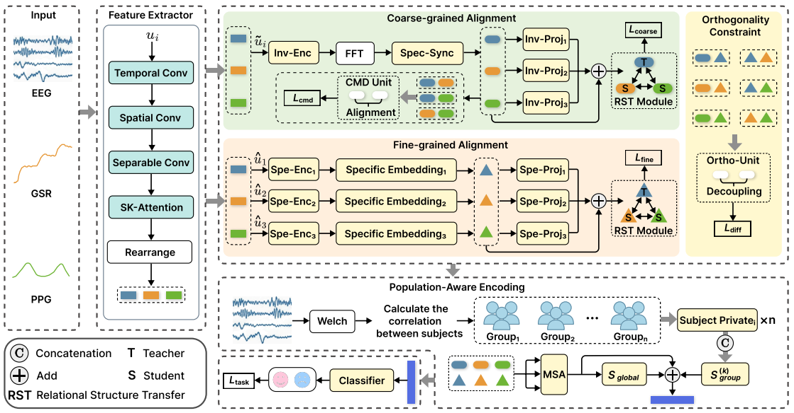

# BPA-Net
This is the official PyTorch implementation of the paper: "Bi-level Alignment Network with Population-Aware Encoding for Cross-Subject Multimodal Emotion Recognition"
# Overview

BPA-Net is a novel deep learning framework designed to tackle two fundamental bottlenecks in multimodal affective computing: temporal asynchrony among heterogeneous modalities and significant inter-subject physiological variability.Key Contributions:Bi-level Relational Structure Transfer (RST): A hierarchical alignment mechanism that synchronizes global spectral distributions and aligns local relational topologies via a teacher-student distillation strategy.Population-Aware Encoding (PAE): A knowledge-driven strategy that clusters subjects into physiological sub-populations based on baseline PSD dynamics, transforming individual variance into exploitable structural priors.Decoupled Representation Learning: Explicitly disentangles physiological streams into modality-invariant and modality-specific subspaces using orthogonality constraints ($L_{diff}$).
# Requirements
Python 3.8+
PyTorch 1.12.0+
NumPy, Scikit-learn, SciPy, Matplotlib
CUDA 11.3+ (Recommended)
# Dataset Preparation
The model is evaluated on the MER and REFED datasets.

Pre-process raw physiological signals (EEG, GSR, PPG, fNIRS) into .pkl files.

Organize the data directory as follows:
data/
├── MER/
│   ├── subject_01.pkl
│   └── ...
└── REFED/
    ├── subject_01.pkl
    └── ...
# Training & Validation
We use a strict Subject-Independent 10-fold Cross-validation protocol to ensure the model's generalization capability.
